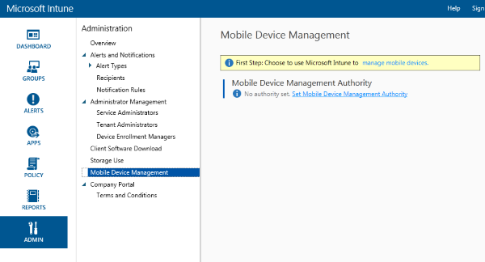

# Set%20mobile%20device%20management%20authority%20as%20Microsoft%20Intune
Before users  can enroll mobile devices with [!INC[wit_nextref](../Token/wit_nextref_md.md)], the IT administrator must declare [!INC[wit_nextref](../Token/wit_nextref_md.md)] as the *mobile device management authority*. A  *mobile device management authority* defines the management service with permission to manage a set of devices.  Solutions for the mobile device management authority include [!INC[wit_nextref](../Token/wit_nextref_md.md)], Configuration Manager with [!INC[wit_nextref](../Token/wit_nextref_md.md)], or Office 365 MDM solutions.

This guidance assumes Intune is used without System Center Configuration Manager integration so the setting should be set to Microsoft Intune.

## MDM authority
**Set mobile device management authority**

> [!IMPORTANT]
> Consider carefully whether you want to manage mobile devices using Intune-only (cloud service only) or System Center Configuration Manager with Intune integration (on-premises in conjunction with cloud service). After you set the mobile device management authority to either of these options, it cannot be changed again. If you're unsure of your options, see [Ways to do enterprise mobility](../Topic/Ways_to_do_enterprise_mobility.md).  The Intune service can be used in conjunction with Office 365. You can specify which cloud service manages specific mobile devices in the Office 365 admin center and Intune admin console, respectively.

#### Set mobile device management authority

1. In the [Microsoft Intune administration console](http://manage.microsoft.com) click **Admin** &gt; **Mobile Device Management**.

2. In the **Tasks** list, click **Set Mobile Device Management Authority**. The **Set MDM Authority** dialog box opens.

   

3. Intune requests confirmation that you want Intune as your MDM authority. Check the box and then click **Yes** to use Microsoft Intune to manage mobile devices.

4. Now that Intune is the MDM authority, you can enable device enrollment for devices:

   - [Enable iOS management](https://technet.microsoft.com/library/dn408185.aspx)

   - [Enable Android management](https://technet.microsoft.com/library/dn764960.aspx)

   - [Enable Windows Phone management](https://technet.microsoft.com/library/dn764959.aspx)

   - [Enable Windows management](https://technet.microsoft.com/library/mt346003.aspx)

## See Also
[Get ready to enroll devices in Microsoft Intune](../Topic/Get_ready_to_enroll_devices_in_Microsoft_Intune.md)

