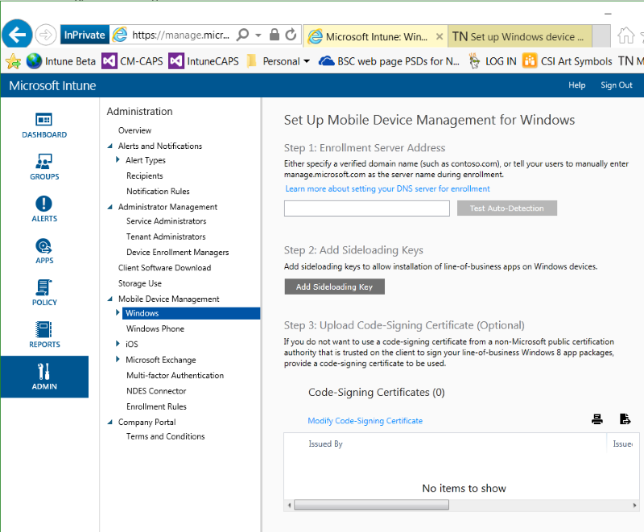

# Set up Windows device management with Microsoft Intune
You can use  [!INC[wit_nextref](../Token/wit_nextref_md.md)] to manage desktops, laptops, and other devices running Windows as mobile devices. You may also want to [Set up Windows Phone management with Microsoft Intune](../Topic/Set_up_Windows_Phone_management_with_Microsoft_Intune.md) or [manage computers with Intune client software](http://technet.microsoft.com/library/dn646959.aspx) using the [!INC[wit_nextref](../Token/wit_nextref_md.md)] client.

## Prepare to manage Windows devices with Intune
To access resources managed with[!INC[wit_nextref](../Token/wit_nextref_md.md)] users can enroll their Windows computers as mobile devices.  Creating a DNS CNAME helps users connect to the [!INC[wit_nextref](../Token/wit_nextref_md.md)] company portal without entering a server name. If you want to deploy the company portal with [!INC[wit_nextref](../Token/wit_nextref_md.md)], you will need to enable sideloading with a sideloading key.   Users can also download and install the company portal from the Store or use software included in Windows. Complete the following steps to set up Windows device management with [!INC[wit_nextref](../Token/wit_nextref_md.md)].

#### Set up Windows device management

1. **Set up [!INC[wit_nextref](../Token/wit_nextref_md.md)]**
   If you haven’t already, [prepare for mobile device management](https://technet.microsoft.com/library/mt346013.aspx) by setting the mobile device management authority to **[!INC[wit_nextref](../Token/wit_nextref_md.md)]**.

2. **Set a DNS alias for the enrollment server address** (optional)

   A DNS alias (CNAME record type) makes it easier for users to enroll their devices by automatically populating the server name during enrollment.

   ###### Verify and create DNS CNAME

   1. In the [Intune administration console](http://manage.microsoft.com), click **Administration** &gt; **Mobile Device Management** &gt; **Windows Phone**.

   2. Type the URL of the verified domain of the company website in the **Specify a verified domain name** box and then click **Test Auto-Detection**.

   3. Create CNAME resource records for your company’s domain. The CNAME resource records must contain the following information:

      |TYPE <br /> <br />|Host Hame <br /> <br />|Points to <br /> <br />|TTL <br /> <br />|
      |--------|-------------|-------------|-------|
      |CNAME <br /> <br />|enterpriseenrollment.company_domain.com <br /> <br />|manage.microsoft.com <br /> <br />|1 Hour <br /> <br />|
      |CNAME <br /> <br />|enterpriseregistration.company_domain.com <br /> <br />|enterpriseregistration.windows.net <br /> <br />|1 Hour <br /> <br />|
      For example, if your company’s website is contoso.com, you would create a CNAME in DNS that redirects EnterpriseEnrollment.contoso.com to manage.microsoft.com. If there is more than one verified domain, create a CNAME record for each domain.

      - `manage.microsoft.com` – Supports a redirect to the Intune service with domain recognition from the email’s domain name

      - `enterpriseregistration.windows.net` – Supports workplace join for mobile devices. It also supports conditional access for Windows 8.1

   

3. **Enable sideloading apps**(Optional)
   For Windows RT 8.1,  Windows 8.1, and  Windows 10 devices, the Company Portal app can be installed from the Windows Store. When not installed directly from the Windows Store, installation of the Company Portal app requires sideloading keys on target computers. See [http://go.microsoft.com/fwlink/?LinkID=290705](http://go.microsoft.com/fwlink/?LinkID=290705) for details on how to deploy sideloading keys. Although sideloaded apps do not have to be certified by the Windows Store or installed through the Windows Store, they can only be installed on sideloading-enabled devices. For more information on acquiring sideloading keys, see [Microsoft Volume Licensing](http://go.microsoft.com/fwlink/?LinkId=264711).

   ###### To code-sign apps for Windows devices

   1. In the [Intune administration console](http://manage.microsoft.com) click **Administration** &gt; **Mobile Device Management** &gt; **Windows** &gt; **Add Sideloading Key**.

   2. In the **Add Sideloading Key** dialog box, enter a name, the sideloading product activation key, the number of total activations, and an optional description, and then click **OK**.

   3. Download the Microsoft Intune Company Portal App for Windows 8.1 from the Download Center [http://go.microsoft.com/fwlink/?LinkId=615800](http://go.microsoft.com/fwlink/?LinkId=615800). Run the downloaded file to extract CompanyPortal.appx file and place it in a network-accessible shared folder.

   4. Run **Windows PowerShell** as an administrator and then enter the following cmdlet:

      ```
      Powershell add-appxpackage –path '‹path›'
      ```

   5. Verify that the **Company Portal** tile is available on in the app list on the target computer (on Windows 8.1 or Windows RT 8.1 devices a tile will be created on the Start screen automatically)

4. **Add Intune users**
   The mobile device owner must be added to the account portal before devices can be enrolled. Log in to the [Microsoft Intune Account Portal](http://go.microsoft.com/fwlink/?LinkId=698854), click **Add users**, and select an option:

   - **User**: To add a single user select **New** &gt; **User** and enter **Details**, **Assign roles**, **Set user location**, and then assign the user to a **Group**.

   - **Bulk add**: Create a .csv file (see samples files provided) and import it into the account portal. Specify roles, location, and group, and then create the accounts. Sample and blank .csv files can be downloaded from the account portal.

   You can also enable Active Directory or Azure Active Directory synchronization. For more information about integrating other Azure Active Directory users with Intune, see [Directory synchronization roadmap](http://go.microsoft.com/fwlink/?LinkId=511540).

5. **Create groups**  (Optional)
   Groups give flexibility for managing devices and users. You can set up groups to suit your organizational needs by geographic location, department, or hardware characteristics, for example.   See [Use groups to manage users and devices with Microsoft Intune](../Topic/Use_groups_to_manage_users_and_devices_with_Microsoft_Intune.md).

6. **Add policies for devices** (Optional)
   Policies are groups of settings that control features on devices. Most MDM policies are platform specific. You create policies using templates  containing recommended or customized settings, and then deploy them to groups. See [Use policies to manage computers and mobile devices with Microsoft Intune](../Topic/Use_policies_to_manage_computers_and_mobile_devices_with_Microsoft_Intune.md).

7. **Set device enrollment limit** (Optional) 
   To limit the number of mobile devices a user can enroll, log in to the [Microsoft Intune administration console](http://manage.microsoft.com), click **Admin** &gt; **Mobile Device Management** &gt; **Enrollment rules**. Select the maximum number of devices a user can enroll and then click **Save**.

8. **Set Company Portal settings** 
    You can customize the Intune Company Portal for your company. In the [Microsoft Intune administration console](http://manage.microsoft.com) click **Admin** &gt; **Company Portal**. Configure the following

   - **Company Name**

   - **IT department contact name**

   - **IT department phone number**

   - **Additional information**

   - **Company privacy statement URL**

   - **Support website URL (not displayed)**

   - **Website name**

9. [!INC[CPEnrollmentTermsAndConditions](../Token/CPEnrollmentTermsAndConditions_md.md)]

10. **Tell users how to get access to company resources with the company portal**
   Your users will need to know how to enroll their devices and what to expect once they're brought into management. [What to tell your end users about using Microsoft Intune](../Topic/What_to_tell_your_end_users_about_using_Microsoft_Intune.md)

## See Also
[Get ready to enroll devices in Microsoft Intune](../Topic/Get_ready_to_enroll_devices_in_Microsoft_Intune.md)

