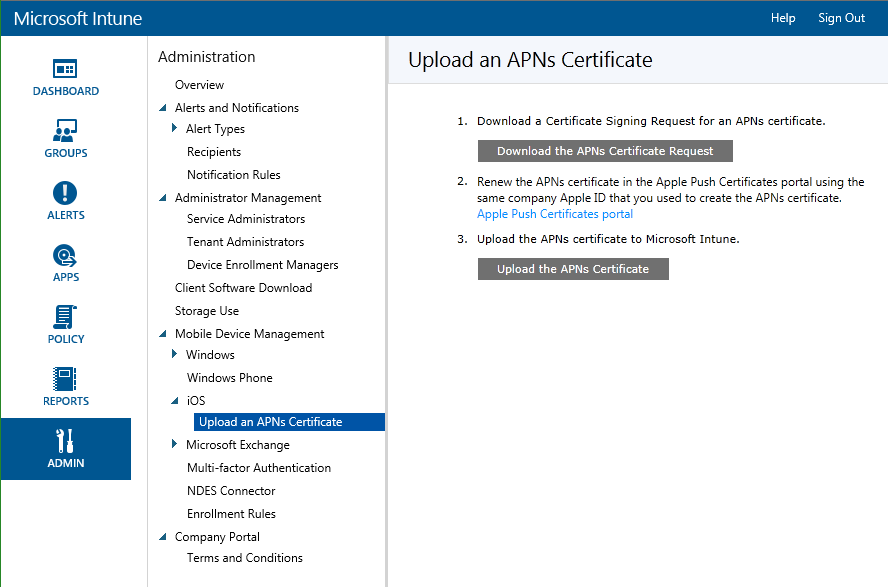

# Set up iOS and Mac management with Microsoft Intune
With [!INC[wit_nextref](../Token/wit_nextref_md.md)], you can enable BYOD ("bring your own device") iOS and Mac OS X device enrollment to give access to company email and apps to iPhone, iPad and Mac users. Once users install the [!INC[wit_nextref](../Token/wit_nextref_md.md)] company portal app, their devices can be targeted with policy using the [!INC[wit_nextref](../Token/wit_nextref_md.md)] administration console.  Before you can manage iOS and Mac devices, you must import an Apple Push Notification service (APNs) certificate from Apple. This certificate allows Intune to manage iOS and Mac devices and establishes an accredited and encrypted IP connection with the mobile device management authority services.

As an alternative to enrollment with the Company Portal app, you can also [enroll corporate-owned iOS devices](https://technet.microsoft.com/en-US/library/dn408185.aspx#BKMK_CODiOS) .

## Prepare to manage iOS and Mac devices with Microsoft Intune
The following steps allow [!INC[wit_nextref](../Token/wit_nextref_md.md)] to manage iOS devices using the Company Portal.

#### Set up iOS and Mac enrollment with Intune

1. **Set up Intune**
   If you haven’t already, prepare for mobile device management by  [setting the mobile device management authority](https://technet.microsoft.com/library/mt346013.aspx) as **Microsoft Intune**.

2. **Get a certificate signing request**
   As an administrative user, open the [Microsoft Intune administration console](http://manage.microsoft.com), go to **Administration** &gt; **Mobile Device Management** &gt; **iOS and Mac OS X** &gt; **Upload an APNs Certificate**, and click **Download the APNs certificate request**. Save the certificate signing request (.csr) file locally. The .csr file is used to request a trust relationship certificate from the Apple Push Certificates Portal.

   

3. **Get an Apple Push Notification service certificate**
   Go to the [Apple Push Certificates Portal](http://go.microsoft.com/fwlink/?LinkId=269844) and sign in with your company Apple ID to create the APNs certificate using the .csr file. This Apple ID must be used in future to renew your APNs certificate. Download the APNs (.pem) certificate and save the file locally. This APNs certificate file is used to establish a trust relationship between the Apple Push Notification server and Intune’s mobile device management authority.

4. **Add the APNs certificate to Intune**
   In the [Microsoft Intune administration console](http://manage.microsoft.com), go to **Administration** &gt; **Mobile Device Management** &gt; **iOS and Mac OS X** &gt; **Upload an APNs Certificate**, and click **Upload the APNs certificate**. **Browse** to the certificate (.pem) file and click **Open** and then enter your **Apple ID**. With the APNs certificate, Intune can enroll and manage iOS devices by pushing policy to enrolled mobile devices.

5. **Add Intune users**
   The mobile device owner must be added to the account portal before devices can be enrolled. Log in to the [Office 365 admin center](http://go.microsoft.com/fwlink/p/?LinkId=698854), click **Add users**, and select an option:

   - **User**: To add a single user select **New** &gt; **User** and enter **Details**, **Assign roles**, **Set user location**, and then assign the user to a **Group**.

   - **Bulk add**: Create a .csv file (see samples files provided) and import it into the account portal. Specify roles, location, and group, and then create the accounts. Sample and blank .csv files can be downloaded from the account portal.

   You can also enable Active Directory or Azure Active Directory synchronization. For more information about integrating other Azure Active Directory users with Intune, see [Directory synchronization roadmap](http://go.microsoft.com/fwlink/?LinkId=511540) or click **Other ways to add users** in the account portal.

6. **Create groups**  (Optional)
   Groups give flexibility for managing devices and users. You can set up groups to suit your organizational needs by geographic location, department, or hardware characteristics, for example.   See [Use groups to manage users and devices with Microsoft Intune](../Topic/Use_groups_to_manage_users_and_devices_with_Microsoft_Intune.md).

7. **Add policies for devices** (Optional)
   Policies are groups of settings that control features on devices. Most MDM policies are platform specific. You create policies using templates  containing recommended or customized settings, and then deploy them to groups. See [Use policies to manage computers and mobile devices with Microsoft Intune](../Topic/Use_policies_to_manage_computers_and_mobile_devices_with_Microsoft_Intune.md).

8. **Set device enrollment limit** (Optional) 
   To limit the number of mobile devices a user can enroll, log in to the [Microsoft Intune administration console](http://manage.microsoft.com), click **Admin** &gt; **Mobile Device Management** &gt; **Enrollment rules**. Select the maximum number of devices a user can enroll and then click **Save**.

9. **Set Company Portal settings** 
    You can customize the Intune Company Portal for your company. In the [Microsoft Intune administration console](http://manage.microsoft.com) click **Admin** &gt; **Company Portal**. Configure the following

   - **Company Name**

   - **IT department contact name**

   - **IT department phone number**

   - **Additional information**

   - **Company privacy statement URL**

   - **Support website URL (not displayed)**

   - **Website name**

10. **Set Terms and Conditions**
   You can publish terms and conditions that your users will see when they first use the company portal from any device, whether or not that device is already enrolled. Users will have to accept those terms to access the portal. When you update the terms and conditions significantly and want users to see and accept them, you can mark the new terms and conditions as a new version, and users will go through the same process the next time they visit the portal.

   In the [Microsoft Intune administration console](http://manage.microsoft.com) click **Company Portal** &gt; **Terms and Conditions**.

   Specify the following:

   - **Require users to accept company terms and conditions before using the Company Portal**

   - **Title**

   - **Text for terms**

   - **Text to explain what it means if the user accepts**

   You can see [details about  terms and condition](https://technet.microsoft.com/library/mt405893.aspx).  You can also see which users have accepted the terms and conditions by using the [Terms and conditions reports](https://technet.microsoft.com/library/dn646977.aspx).

11. **Tell users how to get access to company resources with the company portal**
   [What to tell your end users about using Microsoft Intune](../Topic/What_to_tell_your_end_users_about_using_Microsoft_Intune.md)

## <a name="BKMK_CODiOS"></a>Corporate-owned device (COD) management with Microsoft Intune
As an alternative to enrollment with the Company Portal app, you can enroll corporate-owned devices purchased from Apple. Intune supports the enrollment of corporate-owned iOS devices using the Apple Device Enrollment Program (DEP) or the [Apple Configurator](http://go.microsoft.com/fwlink/?LinkId=518017) tool running on a Mac computer.

You can enroll corporate-enrolled iOS devices in three ways:

- **Device Enrollment Program (DEP)** – Deploys an enrollment profile that enrolls the device “over the air” and can include setup assistant options for the device. Devices enrolled through DEP cannot be un-enrolled by users.

- **Setup Assistant Enrollment** – Factory resets the device and prepares it for setup by the device’s new user. This method supports DEP or Apple Configurator enrollments.

- **Direct Enrollment** – Creates an Apple Configurator-compliant file for use during device preparation. The enrolled device isn’t factory reset. This method cannot be used for DEP enrollment. This method only works if user affiliation is set to "No user affinity."

> [!CAUTION]
> The Intune Company Portal app isn't supported on devices enrolled with these methods. As a result, certain Intune capabilities such as [Conditional Access](https://technet.microsoft.com/library/dn818907.aspx) and [Mobile Application Management](https://technet.microsoft.com/library/dn878026.aspx) are unavailable. You can still deploy Intune [policies](https://technet.microsoft.com/library/mt346005.aspx), [resource access profiles](https://technet.microsoft.com/library/dn997277.aspx) and [required apps](https://technet.microsoft.com/library/dn646955.aspx) to these devices (excluding [those that require MAM policy](https://technet.microsoft.com/library/dn708489.aspx)). To ensure future compatibility with the Company Portal, you should configure **Prompt for User Affinity** for your DEP enrollment profile and set an Apple ID on devices.

### <a name="BKMK_DEP"></a>Apple DEP  management for iOS devices with Microsoft Intune
To manage corporate-owned iOS devices with Apple’s Device Enrollment Program (DEP), your organization must join Apple DEP and acquire devices through that program. Details of that process are available at:  [https://deploy.apple.com](https://deploy.apple.com). Advantages of the program include hands-free set up devices without USB-connecting each device to a computer.

Before you can enroll corporate-owned iOS devices with DEP, you need a DEP Token from Apple. This token allows Intune to sync information about DEP-participating devices owned by your corporation. It also permits Intune to perform Enrollment Profile uploads to Apple and to assign devices to those profiles.

##### Enable DEP management with Intune

1. **Start managing iOS devices with Microsoft Intune**
   Before you can enroll iOS Device Enrollment Program (DEP) devices, you must complete enable iOS management for Intune.

2. **Get an Encryption Key**
   As an administrative user, open the [Microsoft Intune administration console](http://manage.microsoft.com), go to **Admin** &gt; **Mobile Device Management** &gt; **iOS** &gt; **Device Enrollment Program**, and click **Download Encryption Key**. Save the encryption key (.pem) file locally. The .pem file is used to request a trust-relationship certificate from the Apple Device Enrollment Program portal.

3. **Get a Device Enrollment Program token**
   Go to the [Device Enrollment Program Portal](https://deploy.apple.com) (https://deploy.apple.com) and sign in with your company Apple ID. This Apple ID must be used in future to renew your DEP token.

   1. In the [Device Enrollment Program Portal](https://deploy.apple.com) portal, go **Device Enrollment Program** &gt; **Manage Servers**, and then click **Add MDM Server**.

   2. Enter the **MDM Server Name** and then click **Next**. The server name is for your reference to identify the MDM server. It is not name or URL of the Microsoft Intune server.

   3. The **Add &lt;ServerName&gt;** dialog box opens. Click **Choose File…** to upload the .pem file and then click **Next**.

   4. The **Add &lt;ServerName&gt;** dialog box displays a **Your Server Token** link. Download the server token (.p7m) file to your computer, and then click **Done**.

   This certificate (.p7m) file is used to establish a trust relationship between Intune and Apple’s Device Enrollment Program servers.

4. **Add the DEP token to Intune**
   In the [Microsoft Intune administration console](http://manage.microsoft.com), go to **Admin** &gt; **Mobile Device Management** &gt; **iOS** &gt; **Device Enrollment Program**, and click **Upload the DEP Token**. **Browse** to the certificate (.p7m) file, enter your **Apple ID**, and click **Upload**.

5. **Add the Corporate Device Enrollment Policy**
   In the [Microsoft Intune administration console](http://manage.microsoft.com), go to **Policy** &gt; **Corporate Device Enrollment** and then click **Add**. Provide **General** details including **Name** and **Description**, specify whether devices assigned to the profile have user affinity or belong to a group, and then enable **Configure Device Enrollment Program settings for this policy** to support DEP. The **Setup assistant panes** define the iOS device settings configured during setup.

6. **Assign DEP Devices for Management**
   Go to the [Device Enrollment Program Portal](https://deploy.apple.com) (https://deploy.apple.com) and sign in with your company Apple ID. Go **Deployment Program** &gt; **Device Enrollment Program** &gt; **Manage Devices**. Specify how you will **Choose Devices**, provide device information and specify details by device **Serial Number**, **Order Number**, or **Upload CSV File**. Next, select **Assign to Server** and select the &lt;ServerName&gt; specified for Microsoft Intune, and then click **OK**.

7. **Distribute devices to users**
   Your corporate-owned devices can now be distributed to users. When an iOS device is turned on it will be enrolled for management by Intune.

8. **Synchronize DEP-Managed Devices**
   As an administrative user, open the [Microsoft Intune administration console](http://manage.microsoft.com), go to **Admin** &gt; **Mobile Device Management** &gt; **iOS** &gt; **Device Enrollment Program**, and click **Sync now**. A sync request is sent to Apple. To see DEP-managed devices after synchronization, in the [Microsoft Intune administration console](http://manage.microsoft.com) go **Groups** &gt; **All Corporate-Owned Devices**. In the **Corporate-owned Devices** workspace, the **State** for managed devices reads “Not contacted” until the device is powered on and runs the Setup Assistant to enroll the device.

### <a name="BKMK_SAE"></a>Setup Assistant  enrollment for iOS devices with Microsoft Intune
Using Apple Configurator you can factory reset iOS devices and prepares them for setup by the device’s new user.  This method requires you to USB-connect the iOS device to a Mac computer to setup corporate enrollment.

##### Enable Setup Assistant enrollment with Intune

1. **Create mobile device group** (Optional) 
   If your business requires mobile device groups to help manage devices, create those groups. [Use groups to manage users and devices with Microsoft Intune](../Topic/Use_groups_to_manage_users_and_devices_with_Microsoft_Intune.md).

2. **Create a profile for devices**
   A device enrollment profile defines the settings applied to a group of devices. If you have not already, create a device enrollment profile for iOS devices enrolled using Apple Configurator. **Prompt for User Affiliation** should be enabled for **Setup Assistant** enrollment

   ###### To create a profile

   1. In the [Microsoft Intune administration console](http://manage.microsoft.com) go **Policy** &gt; **Corporate Owned Devices**, and then click **Add…**.

   2. Enter details for the device profiles:

      - **Name** – Name of the device enrollment profile. (Not visible to users)

      - **Description** - Description of the device enrollment profile. (Not visible to users)

      - **User affiliation** – Specifies how devices are enrolled.

         - **Prompt for user affinity** – The device can be affiliated with a user during initial setup and could then be permitted to access company data and email as that user. This mode supports a number of scenarios:

            - **Corporate-owned personal device** – “Choose Your Own Device” (CYOD) Similar to privately owned or personal devices but the administrator has certain privileges including permission to wipe, reset, administer, and unenroll the device. The device’s user can install apps and has most other permissions for device use where not blocked by management policy.

            - **Device enrollment manager account** – The device is enrolled using a special Intune administrator account. It can be managed as a private account, but only a user who knows the enrollment manager credentials can install apps, wipe, reset, administer, and unenroll the device. For information about enrolling a device shared by many users through a common account, see [Enroll corporate-owned devices with the Device Enrollment Manager in Microsoft Intune](../Topic/Enroll_corporate-owned_devices_with_the_Device_Enrollment_Manager_in_Microsoft_Intune.md).

         - **No user affinity** – The device is user-less. Use this affiliation for devices that perform tasks without accessing local user data. Apps requiring user affiliation are disabled or won’t work.

      - **Device group pre-assignment** – All devices deployed this profile will initially belong to this group. You can reassign devices after enrollment.

   3. Click **Save Profile** to add the profile.

3. **Add iOS devices to enroll with Setup assistant**
   In the [Microsoft Intune administration console](http://manage.microsoft.com) go **Groups** &gt; **All Devices** &gt; **All Corporate-owned Devices** &gt; **All Devices**, and then click **Add devices…**. You can add devices in two ways:

   - **Upload a CSV file containing serial numbers** – Create a comma-separated value (.csv) list of two columns without a header, limited to 5000 devices or 5MB per csv file.

      |||
      |-|-|
      |&lt;Serial #1&gt; <br /> <br />|&lt;Device #1 Details&gt; <br /> <br />|
      |&lt;Serial#2&gt; <br /> <br />|&lt;Device #2 Details&gt; <br /> <br />|
      This .csv file when viewed in a text editor appears as:

      ```
      0000000,PO 1234
      111111111,PO 1234
      ```

   - **Manually add device details** - Enter the serial number and device details of up to five devices

   > [!NOTE]
   > If you must later remove corporate-owned devices from Intune management, you must remove the device serial number from Intune in the **Corporate-owned devices** group to disable device enrollment.  If Intune performs a disaster recovery procedure on or around the time that serial numbers were removed, you will need to verify that only active devices’ serial numbers are present in that group.

   And then click **Next**.

4. **Select devices to enroll**
   Confirm the devices to enroll. Serial numbers already enrolled or enrolled by other means cannot be imported. Click **Next** to continue.

5. **Assign profile**
   Specify the profile to assign to added devices from the list of available profiles, review the **Enrollment profile details**, and then click **Finish**. Manually added devices can be assigned to any Enrollment profile, but DEP-synced devices must be assigned to a DEP-enabled profile.

6. **Select a profile to deploy to iOS devices**
   In the [Microsoft Intune administration console](http://manage.microsoft.com) go **Policy** &gt; **Corporate Device Enrollment**, and then select the device profile to deploy to mobile devices. Click **Export…** in the taskbar. Copy and save the **Profile URL**. You will upload it in Apple Configurator later to define the Intune profile used by iOS devices. For DEP devices, simply run Setup Assistant from a factory image or factory reset on the device.

7. **Prepare the device with Apple Configurator**
   iOS devices are connected to the Mac computer and enrolled for mobile device management.

   > [!WARNING]
   > The devices will be reset to factory configurations during the enrollment process.

   1. On a Mac computer, open **Apple Configurator**.

   2. Select **Setup** and then **Device Enrollment**. Enter the enrollment URL from Intune in the **MDM Server URL**, and then click **Save**.

   3. Connect the iOS mobile devices to the Apple computer with a USB adapter.

   4. Click **Prepare**. Progress is displayed in Apple Configurator.

8. **Distribute devices**
   The devices are now ready for corporate enrollment. Power down the devices and distribute them to users. When the device is turned on, the setup assistant will start and prompt the user for their work or school account.

### <a name="BKMK_DE"></a>Direct enrollment for iOS devices with Microsoft Intune

##### Enable direct enrollment with Intune

1. **Create mobile device group** (Optional) 
   If your business or organization requires mobile device groups to help manage devices, create those groups. [Use groups to manage users and devices with Microsoft Intune](../Topic/Use_groups_to_manage_users_and_devices_with_Microsoft_Intune.md).

2. **Create a profile for devices**
   A device enrollment profile defines the settings applied to devices. If you have not already, create a device enrollment profile for iOS devices enrolled using Apple Configurator.

   ###### To create a profile

   1. In the [Microsoft Intune administration console](http://manage.microsoft.com) go **Policy** &gt; **Corporate Device Enrollment**, and then click **Add…**.

   2. Enter details for the device profiles:

      - **Name** – Name of the device enrollment profile. Not visible to users.

      - **Description** - Description of the device enrollment profile. Not visible to users.

      - **User affiliation** – Specifies how devices are enrolled. For Direct Enrollment, select **No user affinity**.

      - **Device group pre-assignment** – All devices deployed this profile will initially belong to this group. You can reassign devices after enrollment.

   3. Click **Save Profile** to add the profile.

3. **Select and export an enrollment profile file**
   In the [Microsoft Intune administration console](http://manage.microsoft.com) go **Policy** &gt; **Corporate Device Enrollment**, and then select the device profile to deploy to your iOS devices. Click **Export…** in the taskbar. The **Apple Configuration Method** window opens.

   Under **Apple configurator Method**, select **Direct enrollment**. Download and save the direct enrollment profile file (.mobileconfig). You must import this file into Apple Configurator to define the Intune profile used by iOS devices. An enrollment profile file is valid for 2 weeks.

4. **Import the profile file and prepare the device**
   Copy the Intune enrollment profile file (.mobileconfig) to a Mac computer and import the file into Apple Configurator. You can then USB-connect iOS devices to enroll them using Apple Configurator. Devices configured with this file must already have completed Setup Assistant and must have an internet connection when the file is applied.

## See Also
[Get ready to enroll devices in Microsoft Intune](../Topic/Get_ready_to_enroll_devices_in_Microsoft_Intune.md)

